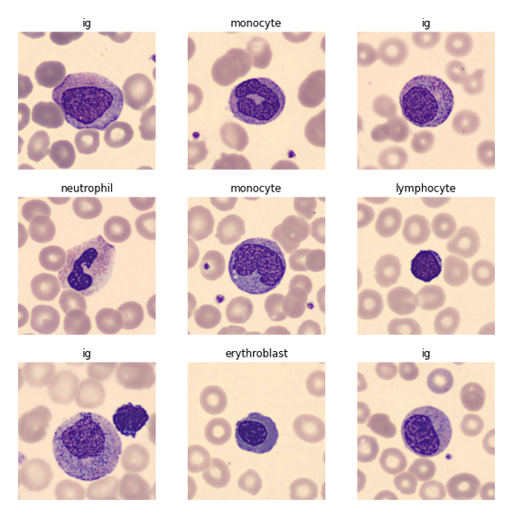
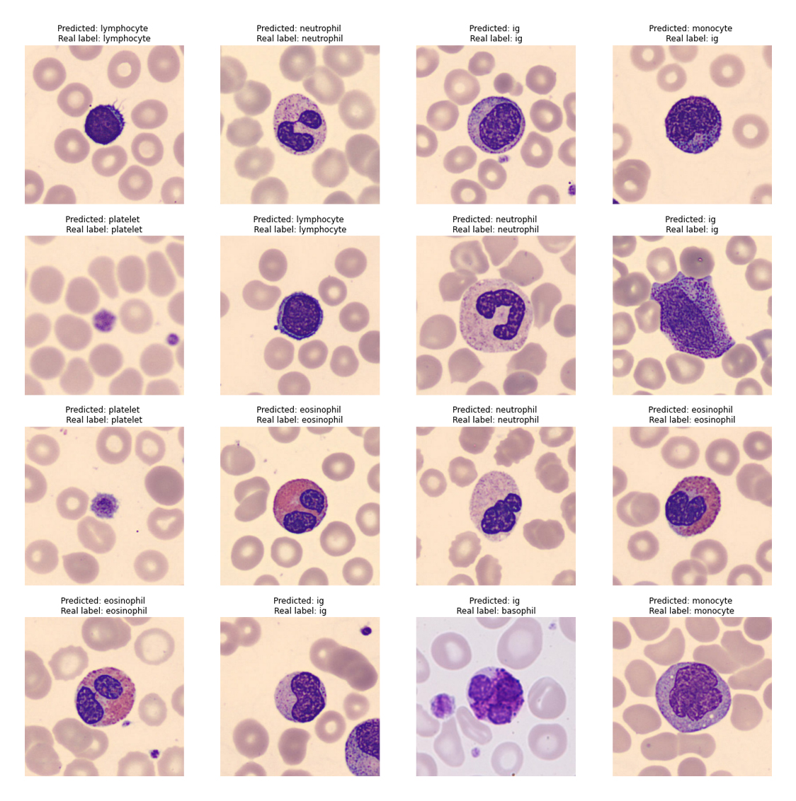

# Blood Cell Classification using CNN
Classification of blood cell images captured using CellaVision DM96 into 8 groups using Deep Learning.

> Originally publised as a Notebook [Kaggle](https://www.kaggle.com/code/devnithw/classifying-blood-cells-using-cnn).
> Bronze winning Notebook.

## About the dataset
The dataset consists of 17,092 jpg images of individual normal cells, captured using the CellaVision DM96 analyzer at the Hospital Clinic of Barcelona. These images are categorized into eight groups: **neutrophils, eosinophils, basophils, lymphocytes, monocytes, immature granulocytes, erythroblasts, and platelets**. The images are `360 x 363 pixels` in size and have been annotated by clinical pathologists.



## Model structure
The model I used is a simple CNN model with two convolutional layers. The model could be improved by using Transfer Learning to build upon a pretrained model.

The code for the model is as follows

```python
model = tf.keras.Sequential([
    keras.Input(shape=(300, 300, 3)),
    # Here is the rescaling layer which we use to normalize the input
    keras.layers.Rescaling(1./255),
    keras.layers.Conv2D(32, 3, activation='relu'),
    keras.layers.MaxPooling2D(),
    keras.layers.Conv2D(32, 3, activation='relu'),
    keras.layers.MaxPooling2D(),
    keras.layers.Dropout(0.2),
    keras.layers.Dense(128, activation='relu'),
    keras.layers.Flatten(),
    keras.layers.Dense(num_classes)
])
```

The full code for the preprocessing, model training and evaluation process is included in the Jupyter Notebook.

## Results

This simple model resulted in a accuracy over 80%. The validation accuracy was 87.5%. As shown in the image below, the model has predicted the label for most images correctly.



## Technologies used
- Kaggle
- Tensorflow and Keras
- Numpy
- Matplotlib